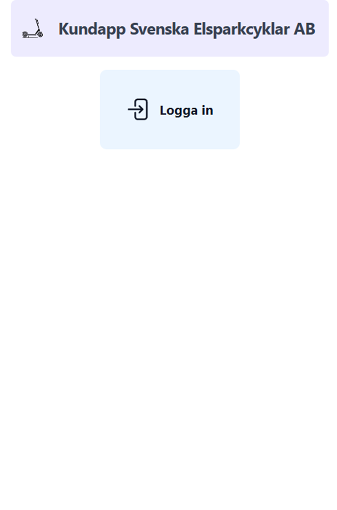
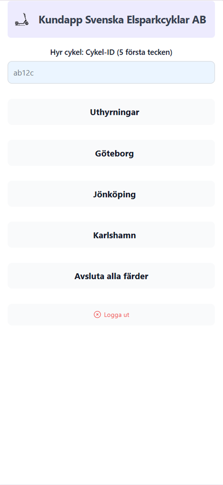
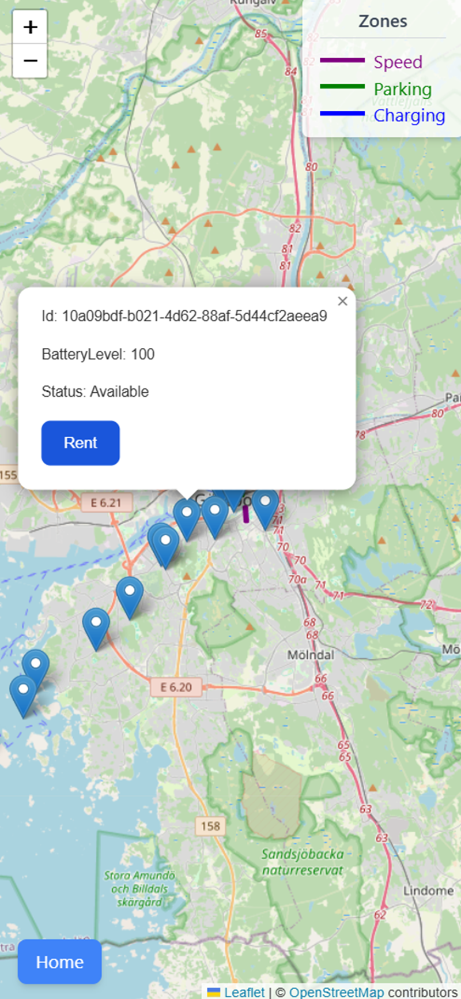
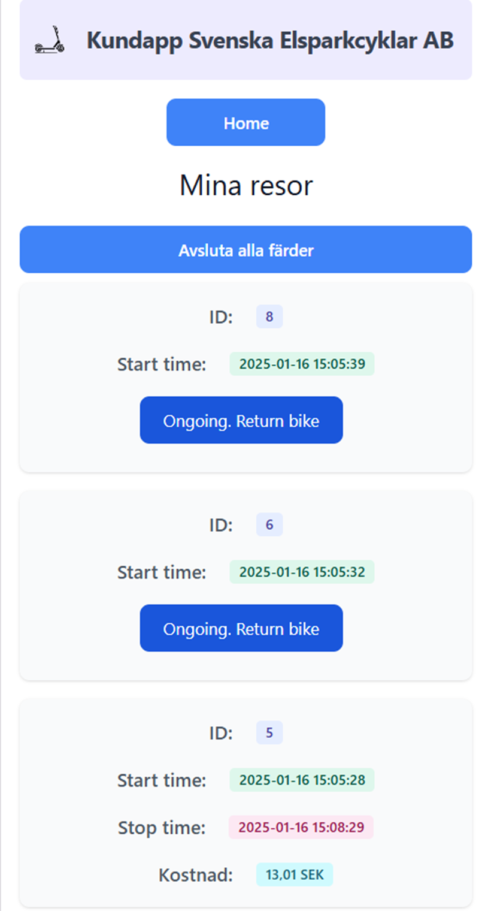

# Introduction
This customer application was developed to meet the customer app requirements in the course [DV1676 at BTH](https://dbwebb.se/kurser/vteam-v1). The app is designed for mobile use, the purpose is to allow customers to rent electric scooters.

The solution was built using React.js and TypeScript, with Tailwind CSS for design. It relies heavily on Flowbite components, and modules such as Redux, React Router DOM, and React Toastify. Leaflet/React-Leaflet, are also used. React Testing Library along with Jest was used for testing.

Many of the functions are borrowed from [here](https://github.com/KarlComSe/SvenskaElsparkcyklarAB/tree/development/frontend)

OAuth through GitHub is used for authentication.

# Introduction
This customer app relies on the backend solution from [backend](https://github.com/KarlComSe/SvenskaElsparkcyklarAB/tree/development/backend). 
1)	Clone the main repo from here [SvenskaElsparkcyklar AB](https://github.com/KarlComSe/SvenskaElsparkcyklarAB/)
2)	Follow backend instructions from [here](https://github.com/KarlComSe/SvenskaElsparkcyklarAB/tree/development/backend)
3)	Adjust config file (`.\src\helpers\config.tsx`) with regards to Github authentication.
4)	Install dependencies: `npm install`
5)	Start the app: `npm run dev`
6)	You can now access the customer app on `localhost:1337`
7)	Unit tests are run with `npm test`

# App Views

**Login**

**Home Page**

**Map with all bikes in city**

**My Rental History**

